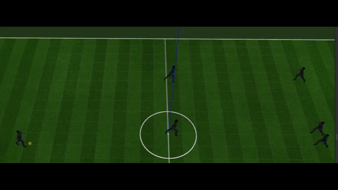

# Gazebo Fifa Soccer Game

Gazebo based football game. 

This game is implemented on a world plugin by using a modified version of gazebo 11.

You can use a USB-Joystick or keyboard for playing. Enjoy:)

## Build :

Clone the submodule of the modified gazebo 11 version (branch "gz11_extended") 

    git submodule update --init --recursive

Build gazebo from source (based on http://gazebosim.org/tutorials?tut=install_from_source&cat=install):

    cd gazebo && mkdir build && cd build && cmake .. && make -j$(nproc)
    sudo make install

Then, build the soccer game

    cd ../.. && mkdir build && cd build && cmake .. &&  make -j$(nproc)

 ## Play :

Plug your USB-joystick and play :

    sh launch/fifaGz5_factory.sh

## Using Keyboard module :

    sh launch/fifaGz5_factory.sh

Press keys moving : i,j,k,l    action:q,s,d,z.

Only works in a separate terminal, press keys in the terminal

